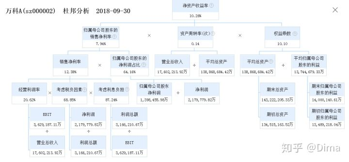

# 商业分析方法

##1. 5W2H

	What: 做什么事
	Where: 在什么场景
	When: 在什么时间
	Who: 使用者是谁
	Why: 为什么
	How: 怎么做
	How much: 量化指标

##2. 波士顿矩阵-象限法
	
	(市场增长率 vs 市场占有率)
	归根为象限法: 通过维度对于目标进行分类, 从而帮助决策或营销
    明星: 高增长率, 高市场占有率
    金牛: 低增长率, 高市场占有率
    问题: 高增长率, 低市场占有率
    瘦狗: 低增长率, 低市场占有率

##3. 逻辑树分析法

	提出问题、解决问题的分析方法
	将问题逐步拆解为若干小问题

##4. 多维度拆解分析

	多维度分类、多维度原因分析等

##5. 对比分析法

	通过对比进行效果评估

##6. 假设验证分析法

	统计方法, 用于对于验证假设是否成立

##7. 漏斗模型分析法

	AARRR周期的漏斗模型
	产品功能漏斗模型
	广告投放效果漏斗模型
	用户使用路径漏斗模型
	......

##8. PEST分析法
	
	常用于行业分析
	政治Political
	经济Economic
	社会Social
	技术Technological

##9. 4P营销理论

	常用于公司营销分析
	产品Product: 什么产品、用户需求、用户画像
	价格Price: 收入、价格、支付方式
	渠道Place: 销售覆盖率、用户实际购买渠道、渠道构成、政策是否有吸引力
	促销Promotion: 促销投入、促销效果、广告投放、广告投放效果

##10. A/B Test

	用于产品功能或界面迭代开发时的效果评估

##11. 杜邦分析法

	用于公司财务状况分析
	1.销售净利率: 公司是否赚钱
	2.总资产周转率: 资产运营效率
	3.权益系数: 债务负担风险
	4.净资产收益率 = 销售净利率*总资产周转率*权益系数

